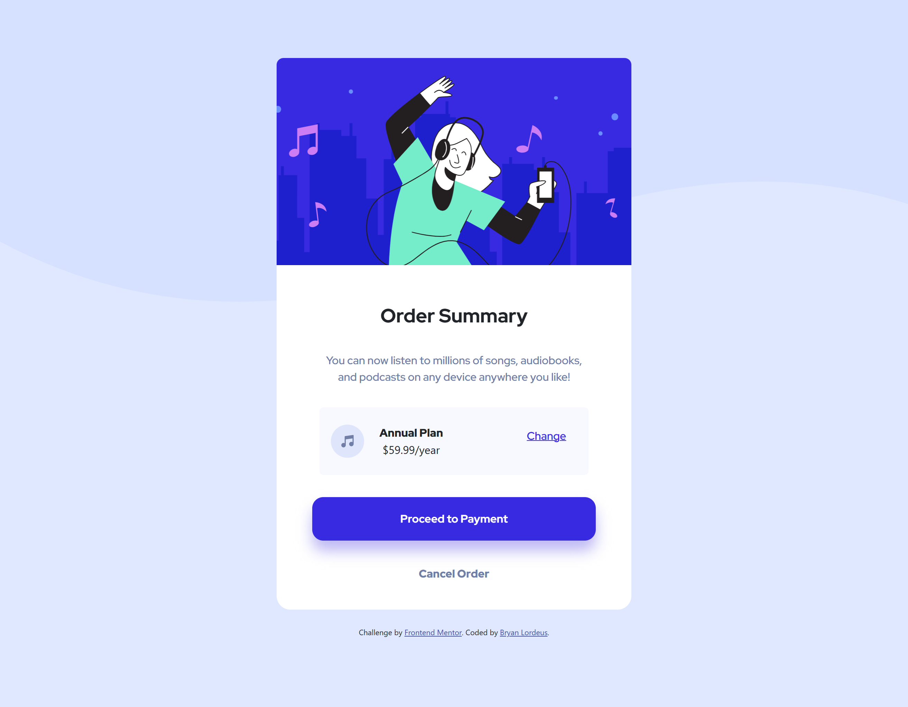

# Frontend Mentor - Order summary card solution

This is a solution to the [Order summary card challenge on Frontend Mentor](https://www.frontendmentor.io/challenges/order-summary-component-QlPmajDUj). Frontend Mentor challenges help you improve your coding skills by building realistic projects.

## Table of contents

* [Overview](#overview)
    * [The challenge](#the-challenge)
    * [Screenshot](#screenshot)
    * [Links](#links)
* [My process](#my-process)
    * [Built with](#built-with)
    * [What I learned](#what-i-learned)
    * [Continued development](#continued-development)
    * [Useful resources](#useful-resources)
* [Author](#author)

## Overview

### The challenge

Users should be able to:

* See hover states for interactive elements

### Screenshot




### Links

* Solution URL: [Add solution URL here](https://your-solution-url.com)
* Live Site URL: [Add live site URL here](https://your-live-site-url.com)

## My process

### Built with

* Semantic HTML5 markup
* Sass
* Flexbox
* CSS Grid
* Mobile-first workflow
* Bootstrap

### What I learned

This is the first time I've used a filter property to apply a drop shadow effect.

``` css
.button-payment { 
    padding: 4% 26%;
    color: white;
    background-color: #382AE1;
    font-family: $font-stack;
    font-weight: 700;
    border: none;
    filter: drop-shadow(0px 15px 10px #BDB8F4);
      &:active {
        background-color: #698DFF;
      }
}
```

### Continued development

Use this section to outline areas that you want to continue focusing on in future projects. These could be concepts you're still not completely comfortable with or techniques you found useful that you want to refine and perfect.

**Note: Delete this note and the content within this section and replace with your own plans for continued development.**

### Useful resources

* [Bootstrap](https://getbootstrap.com/) \- Used the docs as a reference to help organize elements\.
* [Filter - CSS](https://developer.mozilla.org/en-US/docs/Web/CSS/filter) \- This is the first time I've ever used a filter property for a project\. I had to apply a drop shadow to one of the buttons\.

## Author

* Frontend Mentor - [@blordeus](https://www.frontendmentor.io/profile/blordeus)
* Twitter - [@blordeus](https://www.twitter.com/blordeus)